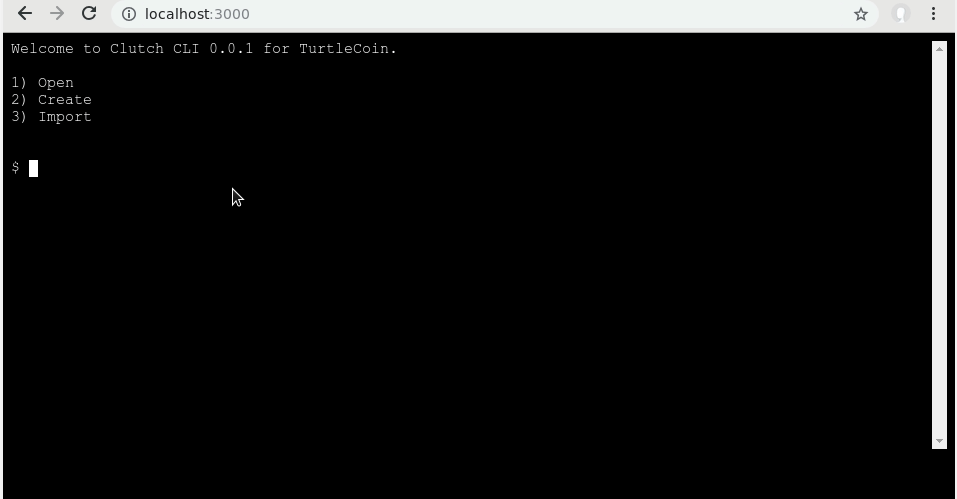

# Clutch

Clutch is a browser based CLI wallet utilzing xterm, socket.io and turtlecoin-wallet-backend to say the very least.



## Disclaimer

This project is still in its early stages, with little to no functionality.

## Getting Started

```
# clone
git clone https://github.com/tojdollar/clutch-web-wallet

# change working directory
cd clutch-web-wallet

# install dependencies
npm i

# start
npm start


```
